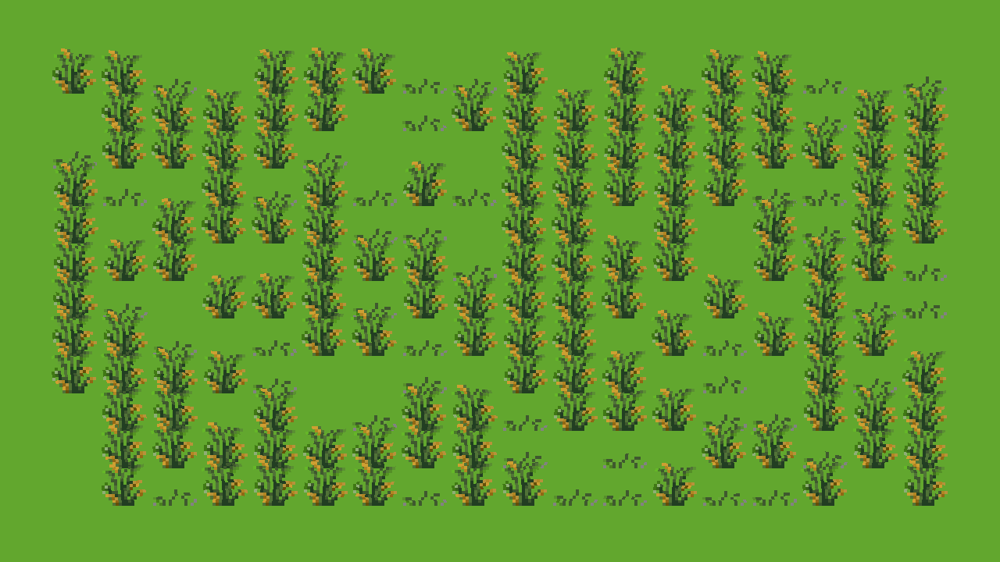

```
           ░         
        ░   ░    ░     _______                            
       ░ ░ ▒▒  ░      |     __|.----.---.-.-----.-----.   
       ▒ ▒▓▒▒ ▒▓ ▒    |    |  ||   _|  _  |__ --|__ --|   
       ░░▓░▒▒▓▒▓▓░▒   |_______||__| |___._|_____|_____|   
       ▒▓▓▓▒▓▓█▒▓▒░  
      ░▓████░▓▓▓▓░░░         Interactive 2D grass
```

# The Ballad of Bellum Style Grass 🌾

A simple project using Raylib to create a waving grass animation effect on a 2D grid. Grass tiles are rendered with a custom shader that applies a "waving" animation, creating a subtle, dynamic landscape. The grass tiles are randomly varied for a more natural appearance. Bear in mind that this is just a tech demo, and that interaction with objects in the scene (the mouse, for example) is missing.

## Features

- **Waving Grass Shader**: Creates a soft waving effect across each grass tile.
- **Multiple Grass Textures**: Two different grass textures (`grass.png` and `short_grass.png`) are used to enhance visual variety.
- **Dynamic Rendering**: The shader modifies the waving effect based on tile position, creating a realistic landscape effect.

<br>



## Requirements

- **Raylib**
- **Gcc**
  
## Project Structure

```py
.
├── src
│   └── main.cpp             # Main program file with game loop and rendering logic
├── res
│   ├── grass.png            # Primary grass texture
│   ├── short_grass.png      # Secondary, shorter grass texture
│   └── waving.fsh           # Fragment shader for waving grass effect
└── README.md                # Project documentation
```

## Compilation
```sh
mkdir -p dist && g++ -Og src/main.cpp -o dist/main -lraylib
```

**Running**
```sh
dist/main
```
